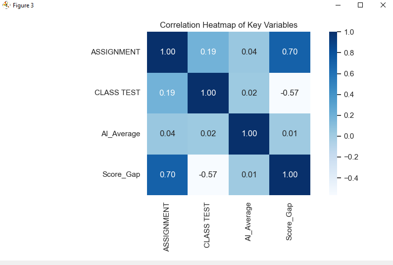
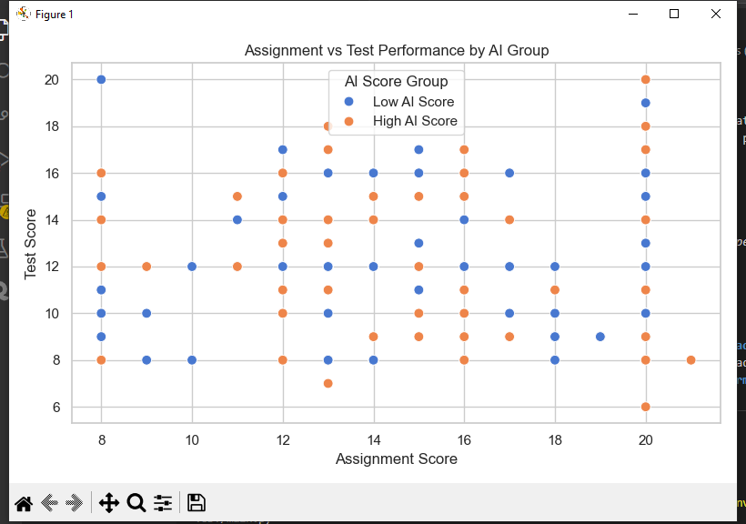

# AI Use and Academic Performance: Exploratory Analysis

###  Project Overview
This project, examines how AI-assisted writing and detection scores relate to students’ actual academic performance. The goal is to understand whether students flagged with high AI involvement perform differently in non-AI-dependent assessments such as class tests.

---

### 🎯 Research Question
> *Does higher AI detection in assignments correspond to lower student performance in subsequent class tests, indicating reduced knowledge transfer or overreliance on AI tools?*

---

###  Objectives
- Analyze correlations between **AI detection scores**, **assignment grades**, and **test results**.  
- Identify whether students with higher AI detection underperform in traditional tests.  
- Explore behavioral insights into **AI-assisted learning** and **performance consistency**.

---

### 🧮 Methods
1. **Data Cleaning** (`src/dataclean.py`)  
   - Handles missing values and formats student performance data.
   - Derives new features: `Score_Gap`, `High_AI`, and `Performance_Level`.
2. **Analysis**  
   - Performs group comparisons and statistical tests.  
   - Calculates Pearson & Spearman correlations, and Cohen’s d.  
   - Summarizes performance by AI score group.

3. **Visualization** (`src/visualization.py`)  
   - Generates correlation heatmaps and boxplots for performance gaps.  
   - Visualizes assignment vs. test relationships across AI groups.

4. **Main Script** (`main.py`)  
   - Integrates all modules and saves computed metrics and plots.

---

### 📊 Key Results (Preliminary)
| Metric | Observation |
|--------|--------------|
| **Students analyzed** | 275 |
| **Performed Well** | 168 |
| **Underperformed** | 107 |
| **High AI Score students** | 153 |
| **Low AI Score students** | 122 |
| **Pearson (AI vs. Score Gap)** | 0.014 (no significant correlation) |
| **Spearman (AI vs. Score Gap)** | -0.048 (no significant correlation) |
| **Cohen’s d (Test performance)** | 0.018 (very small effect) |

**Interpretation:**  
Students with higher AI detection did *not* underperform significantly on test scores. This suggests that AI-assisted work may not inherently reduce knowledge transfer — though potential overreliance patterns require further behavioral study.

NB: Some files are intentionally excluded to maintain privacy and reproducibility.

Excluded:

data/ — contains raw student data not shared publicly.

To reproduce the analysis:

Add your dataset to data/ (e.g., data/student_performance.xlsx).

Create a virtual environment and install dependencies:

pip install (all dependencies)

Run the main script:

python main.py

🧩 Future Work

Include additional learning behavior variables (time on task, participation).

Explore qualitative perceptions of AI-assisted writing among students.

